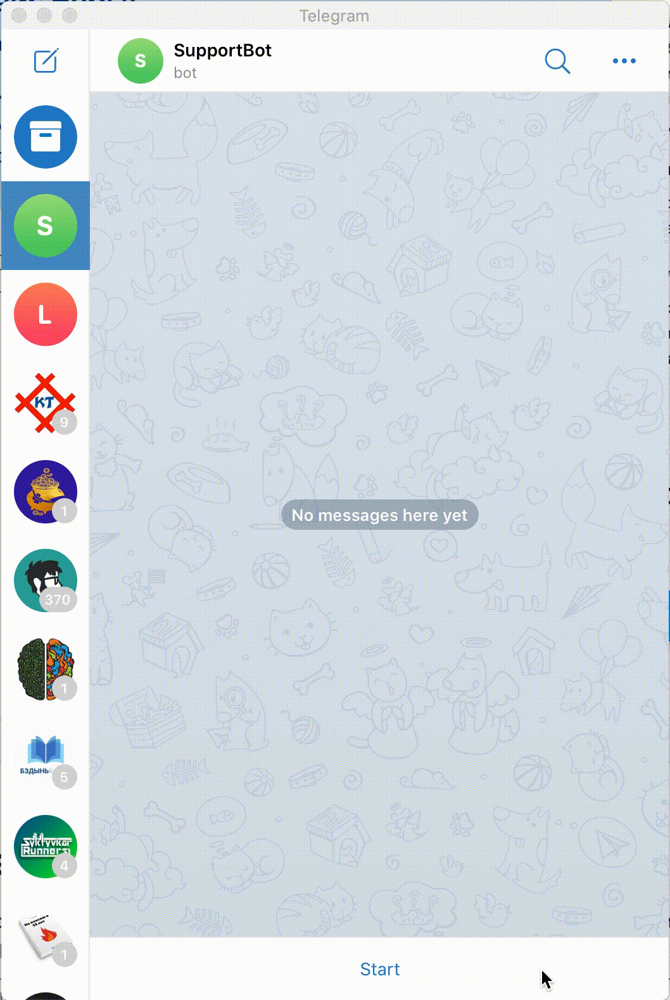

# Бот для технической поддержки

Боты телеграмма и вконтакте в личной переписке отвечают на вопросы пользователя, используя платформу DialogFlow от Google.

Примеры ботов: [телеграмм](t.me/GameOfVerbsBot) и группа [вконтакте](https://vk.com/public199145498)



## Как установить

Для работы бота нужен Python версии не ниже 3.6.

```bash
pip install -r requirements.txt
```

и настроенные переменные окружения:

- `GOOGLE_APPLICATION_CREDENTIALS` - путь к json файлу с парамтерами досутпа к сервисам Google
- `DIALOG_PROJECT_ID` - id проекта для распознования речи, созданного в DialogFlow
- `SUPPORT_TELEGRAM_TOKEN` - токен для телеграмм бота
- `SUPPORT_VK_TOKEN` - токен для бота вконтакте

## Как запустить телеграмм бота

```bash
python tg_bot.py
```

## Как запустить бота вконтакте

```bash
python vk_bot.py
```

## Как запустить обучение системы новым вопросам

В файле `questions.json` заполняем вопросы и ответы в нужном формате и запускаем скрипт обучения

```bash
python training.py
```
